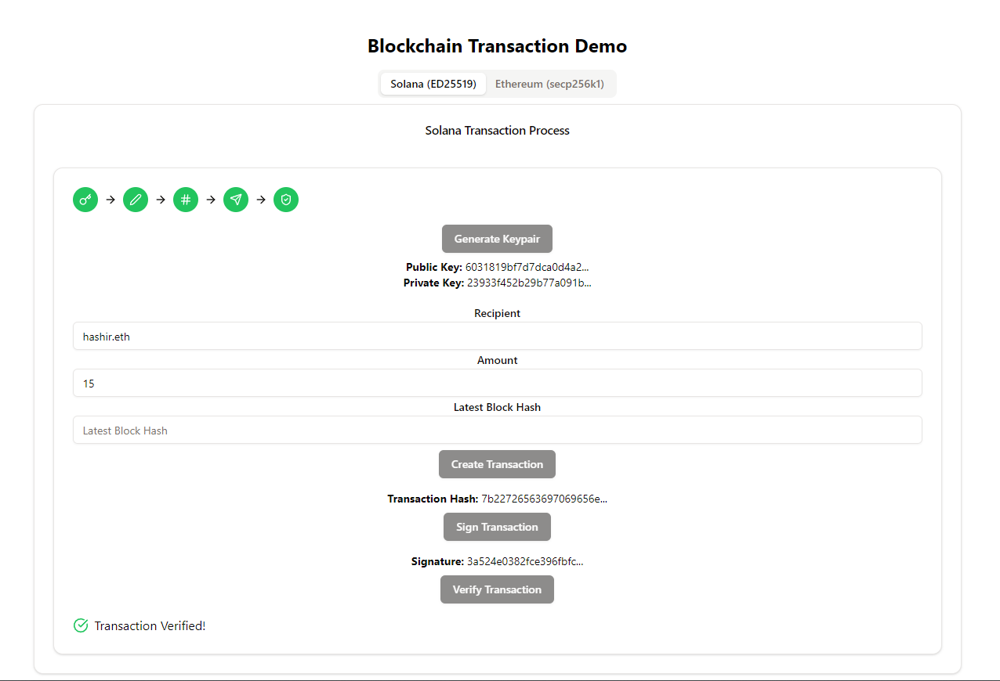

# Blockchain Transaction Demo

Welcome to the **Blockchain Transaction Demo**! This project is an interactive React component that demonstrates how transactions work on the blockchain for two popular blockchain networks: **Solana** and **Ethereum**.

## Introduction

Blockchain technology is revolutionizing the way transactions are conducted, providing a decentralized, secure, and transparent system. Understanding how transactions work on the blockchain is essential for anyone looking to dive into this exciting field.

This demo provides an educational and interactive way to learn about blockchain transactions. It simulates the process for both **Solana** (using ED25519) and **Ethereum** (using secp256k1), allowing users to visualize and understand the steps involved in creating, signing, and verifying blockchain transactions.

## Features

- **Interactive Simulation**: Step-by-step demonstration of the blockchain transaction process.
- **Dual Blockchain Support**: Supports both Solana and Ethereum, showcasing the differences and similarities in their transaction processes.
- **Visual Feedback**: Uses icons and color-coded steps to provide visual feedback at each stage of the transaction.
- **Educational Content**: Perfect for beginners and educators to learn and teach how blockchain transactions are executed.

## Demo



_An interactive demo that guides you through the process of creating and verifying transactions on the blockchain._

## Installation

To run this project locally, you'll need to have Node.js and npm installed. Then follow these steps:

1. Clone the repository:
   ```bash
   git clone https://github.com/your-username/blockchain-transaction-demo.git
   cd blockchain-transaction-demo
   ```

2. Install the required dependencies:
   ```bash
   npm install @noble/ed25519 @noble/secp256k1 lucide-react
   ```

3. Start the development server:
   ```bash
   npm start
   ```

## Usage

Once the local server is running, you can access the demo in your browser at `http://localhost:5173`. The interface will guide you through the process of creating and verifying transactions on both Solana and Ethereum.

### Step-by-Step Process

1. **Generate Keypair**: Create a public/private keypair.
2. **Create Transaction**: Enter transaction details like recipient, amount, and blockchain-specific parameters.
3. **Hash Transaction**: The transaction details are hashed.
4. **Sign Transaction**: The transaction is signed using the private key.
5. **Verify Transaction**: Simulate the miner's role by verifying the transaction.

## Dependencies

This project uses the following libraries:

- **[@noble/ed25519](https://www.npmjs.com/package/@noble/ed25519)**: For key generation and transaction signing on Solana.
- **[@noble/secp256k1](https://www.npmjs.com/package/@noble/secp256k1)**: For key generation and transaction signing on Ethereum.
- **[lucide-react](https://www.npmjs.com/package/lucide-react)**: For icons used in the UI.


## Contributing

We welcome contributions! If you have suggestions or improvements, feel free to open an issue or submit a pull request.